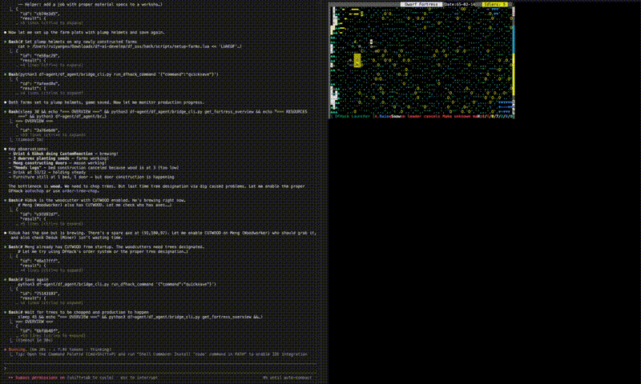

# df-ai: LLM-Powered Autonomous Dwarf Fortress

An AI agent that plays Dwarf Fortress — not through hardcoded rules, but by actually *understanding* the game. Built on Claude and DFHack, df-ai connects a large language model to a live Dwarf Fortress session, letting it observe, reason about, and interact with your fortress in real time.

## Demo



## What Makes This Different

The original df-ai was a C++ DFHack plugin that played the game through hand-written heuristics — impressive, but brittle and scripted. The new **df-agent** system replaces that approach entirely:

- **An LLM reads live game state** — fortress overview, dwarf details, resources, buildings, map tiles — through a structured tool interface
- **It reasons about what to do** — prioritizing threats, planning dig layouts, managing labor, queuing production orders
- **It acts through the same interface** — designating digs, assigning labors, placing buildings, managing military
- **You can talk to it** — a terminal chat UI lets you ask questions, give directions, or just watch it work

The AI doesn't follow a decision tree. It *thinks* about your fortress.

## Architecture

```
┌─────────────────┐         JSON/IPC          ┌──────────────────────┐
│                  │  ◄────────────────────►   │  Dwarf Fortress      │
│  df-agent        │     request/response      │  + DFHack            │
│  (Python + Claude)│                          │  + df-agent-bridge   │
│                  │                           │    (Lua)             │
└─────────────────┘                           └──────────────────────┘
       │
       ├── agent.py        — Claude API tool-use loop
       ├── client.py       — Bridge client (file-based IPC)
       ├── tools.py        — Tool definitions (observe + act)
       ├── system_prompt.py — Game knowledge + context injection
       ├── cli.py          — Terminal chat UI (Rich + prompt_toolkit)
       └── bridge_cli.py   — Direct bridge commands (scripting)
```

The bridge is a Lua script running inside DFHack that polls for JSON request files every game frame, executes commands against DF's internal APIs, and writes JSON responses back. The Python side can either drive an autonomous agent loop (via Claude) or be used directly for scripting.

## Quick Start

### Prerequisites

- Dwarf Fortress with DFHack (v0.47.05 tested)
- Python 3.9+
- An Anthropic API key (`ANTHROPIC_API_KEY` env var)

### Setup

1. **Install the bridge script** into your DFHack scripts folder:
   ```
   cp df_osx/hack/scripts/df-agent-bridge.lua <your-DF>/hack/scripts/
   ```

2. **Auto-start the bridge** — add to `<your-DF>/dfhack-config/init/onMapLoad.init`:
   ```
   df-agent-bridge start
   ```

3. **Install Python dependencies:**
   ```bash
   cd df-agent
   pip install anthropic prompt-toolkit rich
   ```

4. **Disable the legacy C++ plugin** (if enabled) — comment out `enable df-ai` in your `dfhack.init`.

### Play

1. Start Dwarf Fortress with DFHack:
   ```bash
   cd <your-DF>
   ./dfhack                        # Linux/Mac
   arch -x86_64 ./dfhack           # Apple Silicon Mac
   ```

2. Load or start a fortress.

3. In a separate terminal, start the agent:
   ```bash
   cd df-agent
   python -m df_agent
   ```

4. Chat with your AI advisor, or let it manage the fortress autonomously.

### Chat Commands

| Command       | Description                  |
|---------------|------------------------------|
| `/connect`    | Connect to game bridge       |
| `/disconnect` | Disconnect from bridge       |
| `/status`     | Show fortress status         |
| `/pause`      | Pause the game               |
| `/unpause`    | Unpause the game             |
| `/clear`      | Clear conversation history   |
| `/quit`       | Exit df-agent                |

## What the Agent Can Do

### Observe
- Fortress overview (population, food, drink, season, announcements)
- Individual dwarf details (skills, labors, inventory)
- Resource stockpiles and workshops
- Map tiles and terrain
- Military squads and manager orders

### Act
- Designate digging (stairs, channels, ramps)
- Assign and toggle dwarf labors
- Queue manager production orders
- Place buildings and workshops
- Run arbitrary DFHack commands
- Pause/unpause the game

## Scripting (Without the LLM)

You can also use the bridge directly for automation scripts:

```bash
# Check connection
python3 df-agent/df_agent/bridge_cli.py ping

# Read game state
python3 df-agent/df_agent/bridge_cli.py get_fortress_overview
python3 df-agent/df_agent/bridge_cli.py get_units '{"filter":"citizens"}'
python3 df-agent/df_agent/bridge_cli.py get_resources

# Take actions
python3 df-agent/df_agent/bridge_cli.py designate_dig '{"x":100,"y":100,"z":177,"w":5,"h":5,"dig_type":"Default"}'
python3 df-agent/df_agent/bridge_cli.py assign_labor '{"unit_id":5085,"labor":"MINE","enable":true}'
python3 df-agent/df_agent/bridge_cli.py add_manager_order '{"job_type":"BrewDrink","quantity":5}'
```

See [df-agent/AGENT_GUIDE.md](df-agent/AGENT_GUIDE.md) for the full command reference.

## Legacy C++ Plugin

The original C++ plugin (all the `.cpp`/`.h` files in the repo root) is still present for reference. It handled embarking, fortress planning, population management, resource management, trading, and military through hardcoded logic. The new df-agent system supersedes it — disable it in `dfhack.init` if you're using the agent.

## Credits

Original df-ai plugin by [BenLubar](https://github.com/BenLubar/df-ai). LLM agent system built on top of the DFHack framework and Anthropic's Claude API.

[](https://xkcd.com/1223/)
